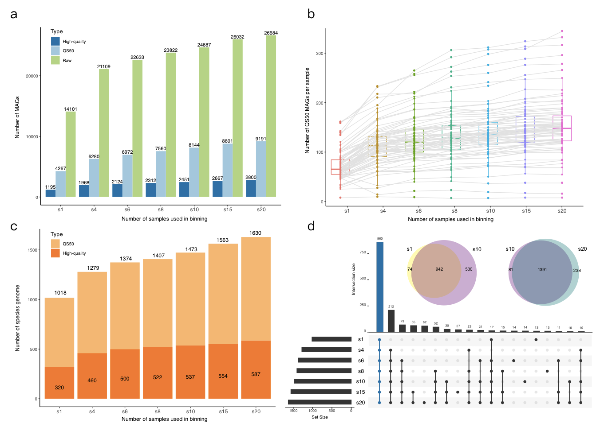

[中文版](README_CH.md)

## 1. Introduction

Design for large-scale metagenomic assembly of fecal samples, the pipeline includes 4 parts: 

1) Filter out low-quality reads and host contamination by fastp and Bowtie2;

2) Assembly metagenomics samples separately by MEGAHIT;

3) Bin the contigs to Metagenomic assembly genomes (MAGs) by MetaBAT2;

4) Evalue genomic quality with CheckM.


In this pipeline, we offer a new strategy of binning we called co-abundance binning. Multiple samples are used to bin contigs from single sample to obtain MAGs. This strategy has the following advantages:

1) Compared with co-assembly strategy, single sample assembly can avoid the hybridization of strains in multiple samples, resulting in fragmentation of configs and high strain heterogenicity of genomes (Figure 1). And  it also can significantly reduce computatial memory.

<div align="center"></div>
<p align="center">Figure 1 Mixing of strains will lead to poor assembly quality.</div>
<p align="center">Source: https://drep.readthedocs.io/en/latest/overview.html#genome-de-replication</p>


2) Compared with the common strategy of single sample binning, our strategy can make full use of the abundance and correlation information of config in mulitiple samples. 

We used 79 horse metagenomes to evaluated our strategy. First, all samples were assembled separately. Then, we used 1, 4, 6, 8, 10, 15, and 20 samples (referred to as s1 – s20), a total of 7 groups, to test the influence of different number of samples used in co-abundance binning. 

Compared with the s1 group, the total number of bins, QS50 MAGs, and High-quality MAGs increased to 89%, 115%, and 134% in the s20 group (Figure 2a). In almost all samples, the number of QS50 MAGs per sample increased with the number of samples used in binning(Figure 2b). 

The QS50 MAGs in 7 groups were clustered into the species-level clusters by dRep separately. More species were obtained when more samples were used in binning. Compared with s1, the total SGBs of s20 increase to 60%, and the high-quality SGBs also increase to 83% (Fig S1c). The overlaps of representative species genomes were calculated by dRep in all 7 groups, and good consistency was observed in our strategy (Fig S1d). Compared with s1 group, 530 new SGBs ( 52.17% SGBs in s1) were obtained and 942 SGBs (92.72% SGBs in s1) in s1 were overlapped in s10 group. 


<p align="center">Figure2 Evaluation results of our co-abundance strategy.</p>


**If you use this pipeline, please cite the paper:**

[TBD]


## 2. Install

Install by conda：
```shell
conda env create -n meta_assembly -f rules/environment.yaml
conda active meta_assembly
```

Download the host's genome and build the Bowtie2 index
```shell
# GRCh38.p13 (human)
# https://www.ncbi.nlm.nih.gov/assembly/GCF_000001405.39
mkdir -p 0.data/host_index && cd 0.data/host_index
curl -O https://ftp.cngb.org/pub/Assembly/GCA/000/001/405/GCA_000001405.28_GRCh38.p13/GCA_000001405.28_GRCh38.p13_genomic.fna.gz
bowtie2-build --threads 4 GCA_000001405.28_GRCh38.p13_genomic.fna.gz hg38.p13
```

## 3. usage

### 3.1 Demo data
Three simulated metagenomes were generated using three bacteria genomes.
```shell
sh demo/work.iss.sh
```

### 3.2 Input

See sample.txt (separated by tabs) for the sample input format. Only PE reads are supported.

```shell
$ cat sample.txt
id	fq1	fq2
test1	demo/test1_data_R1.fastq.gz	demo/test1_data_R2.fastq.gz
test2	demo/test2_data_R1.fastq.gz	demo/test2_data_R2.fastq.gz
test3	demo/test3_data_R1.fastq.gz	demo/test3_data_R2.fastq.gz
```

### 3.3 Parameters

Parameters and file's names can be set in ```rules/assemble.config.yaml```.

**Note**: Update the path for bowtie2_index to "/your_path/0.data/host_index/hg38.p13".

```yaml
params:
    ### step1 assembly
    fastp:
      min_len : 70 # Recommended value >= 30
    #rmhost
    rmhost:
      bowtie2_index : "/path/to/host_bowtie2_index"
      threads: 8
    #megahit
    megahit:
      threads: 16
      min_contigs_len: 200
    #binning
    metabat2:
      multi_samples: 3 # Recommended 10
      threads: 16
      minContig: 1500 #should be >=1500
    #quality
    checkm:
      threads: 8
    pick:
    # "completeness, contamination, strain_heterogeneity" from CheckM
    # Default : MIMAG standard.
    # <0 : no filter
      HQ: "90,5,-1"
      MQ: "50,10,-1"

...
```

### 3.4a. Locally run

First, do dry-run to test.

```shell
snakemake \
--snakefile rules/assemble.smk \
--configfile rules/config.yaml \
--core 1 \
--dry-run
```

Then use --core to specify the CPU resource to run locally.

```shell
snakemake \
--snakefile rules/assemble.smk \
--configfile rules/config.yaml \
--core 32 2> smk.log
```

### 3.4b. Cluster execution (qsub)

The CPU and memory required for each step can be set in ```rules/cluster.yaml```，don't forget to update your project_ID and queue in this file.

```yaml
localrules: all

__default__:
  queue: "st.q"
  project: "your_project_ID"
  workdir: "./"
  mem: "1G"
  cores: 1

filter:
  mem: "4G"
  cores: 4
  output: "1.assay/cluster_logs/{rule}.{wildcards}.o"
  error: "1.assay/cluster_logs/{rule}.{wildcards}.e"

...
```

Then, use the following command to post all tasks.

```shell
if [ ! -d 1.assay/cluster_logs ];then mkdir -p 1.assay/cluster_logs;fi

snakemake \
--snakefile rules/assemble.smk \
--configfile rules/config.yaml \
--cluster-config rules/cluster.yaml \
--jobs 80 \
--keep-going \
--rerun-incomplete \
--latency-wait 360 \
--cluster "qsub -S /bin/bash -cwd -q {cluster.queue} -P {cluster.project} -l vf={cluster.mem},p={cluster.cores} -binding linear:{cluster.cores} -o {cluster.output} -e {cluster.error}"
```

### 3.5. co-abundance binning

The result of single sample binning can be obtained when you finish the snakemake process. Becaues of random sampling, the co-abundace binning scirpts are generated using ```mulit_samples_binning.py``` for reproducible research.

You can change the number of samples used in co-abundance binning in ```rules/config.yaml```. More than 10 samples are recommended in the real research.

```shell
python rules/tools/multi_samples_binning.py sample.txt rules/config.yaml

sh work1_multi_metabat.sh && sh work2_multi_checkm.sh && sh work3_multi_summary.sh
```

### 4. Statistical results

01.assembly/filter_summary.txt

01.assembly/contigs_stat.txt

02.binning_s1/map2scaftigs_summary.txt

02.binning_s1/All_bins_stat.txt

02.binning_s1/picked_MAGs_quality.txt

02.binning_s1/MAGs_per_sample.txt

The result files of co-abundance binning are named with the same name of single sample binning.


## 5. FAQ

### 1. Single-end sequencing？Want to change the software in the pipeline?

The design philosophy of this pipeline is "less is better". You can try [metapi](https://github.com/ohmeta/metapi).

### 2. Follow-up analysis pipeline?
Clust MAGs to species: [dRep](https://github.com/MrOlm/drep)

Taxonomic profile by unique alignment：https://github.com/QTP-team/meta_profile

Taxonomic profile by Kraken: see "Customizable database for Kraken"
