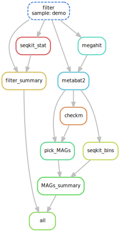

适用于肠道，舌苔等高宿主率样本组装。15G数据量megahit需要40G内存，30G数据量需要80G。同等数据量下，metaspades需要的内存以及计算量都是megahit的3-4倍。



输入raw data，输出高中质量的bins。输入文件格式见sample.txt。内有demo数据可以直接运行测试。

依赖软件
```
conda install \
python==3.6 \
fastp==0.20.1 \
bowtie2=2.3.5.1 \
samtools==1.9 \
seqkit==0.13.2 \
megahit==1.2.9 \
metabat2==2.15 \
checkm-genome==1.1.2
```

若在华大集群上，可加载我的环境变量。
```
export PATH="$PATH:/ldfssz1/ST_META/share/User/tianliu/bioenv/conda/envs/meta_assemble_wdl/bin"
```

使用方法见work.sh。

WDL版本源码见rules/WDL文件夹，可以在自动化平台()调用。
